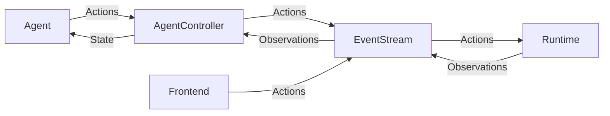

# OpenHands 架构

本目录包含 OpenHands 的核心组件。

下图展示了各组件的角色以及它们如何通信与协作：


## 类

OpenHands 中的关键类包括：

* **LLM**：负责与大型语言模型的所有交互。由于使用了 LiteLLM，可兼容任何底层的完成模型。
* **Agent**：查看当前的 State 并生成一个 Action，将流程向最终目标推进一步。
* **AgentController**：初始化 Agent、管理 State，并驱动主循环，逐步推进 Agent 的执行。
* **State**：表示 Agent 任务的当前状态，包含当前步骤、近期事件历史、Agent 的长期计划等信息。
* **EventStream**：事件的中央枢纽，任何组件既可在此发布事件，也可监听其它组件发布的事件。

  * **Event**：包括 Action 与 Observation

    * **Action**：表示对环境的操作请求，如编辑文件、运行命令或发送消息
    * **Observation**：表示从环境中收集的信息，如文件内容或命令输出
* **Runtime**：负责执行 Actions，并返回相应的 Observations

  * **Sandbox**：Runtime 中用于运行命令的子模块，例如在 Docker 容器内执行
* **Server**：通过 HTTP 管理 OpenHands 会话，例如驱动前端

  * **Session**：持有一个 EventStream、一个 AgentController 及一个 Runtime，通常对应一个完整的任务（可能包含多个用户提示）
  * **ConversationManager**：维护所有活跃会话列表，确保请求路由至正确的 Session

## 控制流程

下面的伪代码展示了驱动 Agent 运行的基本循环：

```python
while True:
  prompt = agent.generate_prompt(state)
  response = llm.completion(prompt)
  action = agent.parse_response(response)
  observation = runtime.run(action)
  state = state.update(action, observation)
```

实际上，绝大部分通信都是通过 EventStream 的消息传递来完成的。EventStream 构成了 OpenHands 中所有组件间通信的骨架：



## Runtime

如需了解 `Runtime` 的更多细节，请参阅官方[文档](https://docs.all-hands.dev/usage/architecture/runtime)。
