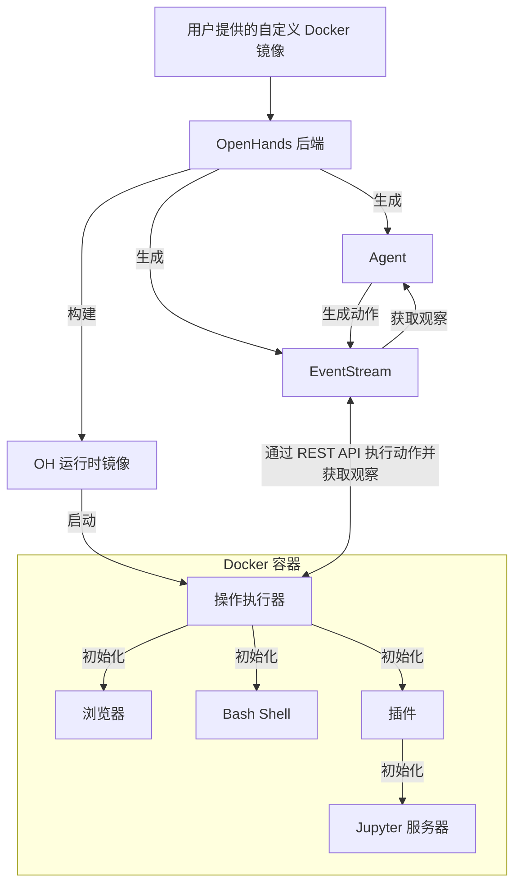

# 运行时架构

OpenHands Docker 运行时是使 AI Agent 的操作能够安全、灵活执行的核心组件。它使用 Docker 创建一个沙箱环境，在其中可安全运行任意代码，而无需担心影响宿主系统。

## 为什么需要沙箱运行时？

OpenHands 需要在一个安全、隔离的环境中执行任意代码，原因包括：

1. **安全性**：执行不受信任的代码可能对宿主系统构成重大风险。沙箱环境可防止恶意代码访问或修改宿主系统资源。
2. **一致性**：沙箱环境确保在不同机器和配置上代码执行行为一致，消除“在我机器上可以运行”的问题。
3. **资源控制**：沙箱能够更好地控制资源分配与使用，防止失控进程影响宿主系统。
4. **隔离性**：不同项目或用户可在各自隔离环境中工作，互不干扰。
5. **可重现性**：沙箱环境因其一致性和可控性，更易于重现和调试问题。

## 运行时如何工作？

OpenHands 运行时系统采用基于 Docker 容器的客户端—服务器架构。工作流程概览如下：

1. **用户输入**：用户提供一个自定义基础 Docker 镜像
2. **镜像构建**：OpenHands 基于用户镜像构建一个新的“OH 运行时镜像”，其中包含 OpenHands 专用的运行时代码（主要是“运行时客户端”）
3. **容器启动**：OpenHands 启动时，使用 OH 运行时镜像启动一个 Docker 容器
4. **执行服务器初始化**：容器中初始化一个 `ActionExecutor`，并设置 Bash Shell、加载指定插件等必要组件
5. **通信**：OpenHands 后端（`openhands/runtime/impl/eventstream/eventstream_runtime.py`）通过 RESTful API 与操作执行服务器通信，发送动作并接收观察结果
6. **动作执行**：运行时客户端接收后端发送的动作，在沙箱环境中执行后，将结果封装为观察返回
7. **观察返回**：执行服务器将观察结果返回给 OpenHands 后端

客户端的作用：

* 充当 OpenHands 后端与沙箱环境之间的中介
* 在容器内安全地执行各种类型的动作（Shell 命令、文件操作、Python 代码等）
* 管理沙箱环境状态，包括当前工作目录和已加载插件
* 将观察结果格式化并返回给后端，确保结果处理接口一致

## OH 运行时镜像的构建与管理

OpenHands 通过高效、一致且灵活的方式构建和维护用于生产与开发环境的 Docker 运行时镜像。

如需深入了解，请查看 [相关代码](https://github.com/All-Hands-AI/OpenHands/blob/main/openhands/runtime/utils/runtime_build.py)。

### 镜像标签系统

OpenHands 对运行时镜像使用三种标签系统，以在可重现性和灵活性之间取得平衡。标签可采用以下两种格式之一：

* **版本化标签**：`oh_v{openhands_version}_{base_image}`
  例如：`oh_v0.9.9_nikolaik_s_python-nodejs_t_python3.12-nodejs22`
* **锁定标签**：`oh_v{openhands_version}_{16位锁哈希}`
  例如：`oh_v0.9.9_1234567890abcdef`
* **源标签**：`oh_v{openhands_version}_{16位锁哈希}_{16位源哈希}`
  例如：`oh_v0.9.9_1234567890abcdef_1234567890abcdef`

#### 源标签（最具体）

取源代码目录哈希的 MD5 前 16 位，只针对 OpenHands 源码生成哈希。

#### 锁定标签

取以下内容的 MD5 前 16 位生成哈希：

* 构建镜像所用基础镜像名称（如 `nikolaik/python-nodejs:python3.12-nodejs22`）
* 镜像中包含的 `pyproject.toml` 文件内容
* 镜像中包含的 `poetry.lock` 文件内容

该哈希独立于源码，仅代表 OpenHands 的依赖。

#### 版本化标签（最通用）

将 OpenHands 版本与基础镜像名称（经过格式转换）拼接而成。

#### 构建流程

1. **无需重建**：首先检查是否存在相同的**源标签**镜像。如存在，则直接使用，无需重建。
2. **快速重建**：否则检查是否存在相同的**锁定标签**镜像。如存在，则基于该镜像构建新镜像，跳过安装依赖等步骤，仅复制源码，并打上**源标签**。
3. **中速重建**：若无源标签与锁定标签镜像，则基于**版本化标签**镜像重建（此镜像已预先安装大多数依赖，节省时间）。
4. **最慢重建**：若以上标签均不存在，则基于基础镜像全新构建，并打上所有三种标签。

此标签策略让 OpenHands 能够：

* 确保相同源码和 Dockerfile 始终生成相同镜像（通过哈希标签）
* 在小幅更改时快速重建镜像（利用兼容镜像）
* 通过锁定标签始终指向特定基础镜像、依赖与 OpenHands 版本组合的最新构建

## 运行时插件系统

OpenHands 运行时支持插件系统，可扩展功能并自定义运行时环境。插件在运行时客户端启动时初始化。

如果您想实现自定义插件，可参考 [Jupyter 插件示例](https://github.com/All-Hands-AI/OpenHands/blob/ecf4aed28b0cf7c18d4d8ff554883ba182fc6bdd/openhands/runtime/plugins/jupyter/__init__.py#L21-L55)。

> 更多插件系统细节尚在完善中，欢迎贡献！

插件系统的关键要素：

1. **插件定义**：插件通过继承基类 `Plugin` 的 Python 类来定义。
2. **插件注册**：所有可用插件在 `ALL_PLUGINS` 字典中注册。
3. **插件指定**：插件与 `Agent.sandbox_plugins: list[PluginRequirement]` 关联，用户可在初始化运行时时指定加载哪些插件。
4. **初始化**：运行时客户端启动后异步初始化指定插件。
5. **使用**：运行时客户端可调用已初始化插件来扩展能力（如使用 `JupyterPlugin` 运行 IPython 单元）。
